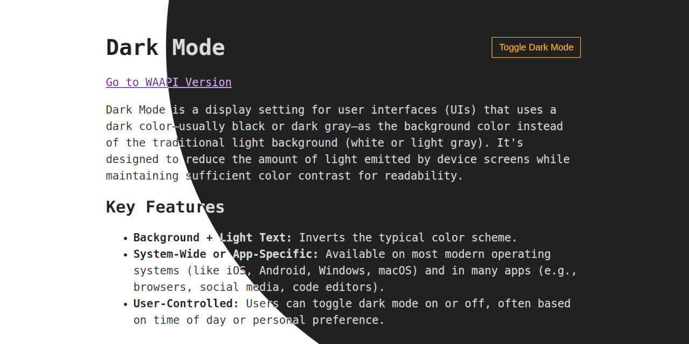

I’m a total dark mode fan. It’s the first thing I switch on whenever I get a new device. Modern browsers finally play nice with dark mode out of the box. So I think it’s time to bring that sleek, eye-friendly aesthetic to the web!



[Demo](https://renekaesler.github.io/demo-dark-mode-transition) |
[Code](https://github.com/renekaesler/demo-dark-mode-transition)


## The Foundation

A solid dark mode starts with respecting user preferences:

```css
:root {
  color-scheme: light dark;

  --accent: light-dark(#0d47a1, #ffb300);
  --canvas: light-dark(#ffffff, #212121);
  --text: light-dark(#212121, #dcdcdc);
}
```

First, we define the [`color-schemes`](https://developer.mozilla.org/en-US/docs/Web/CSS/color-scheme) the page can be rendered in. This ensures that scroll bars, form controls or other user interfaces provided by the browser conform to the specified scheme. In our case, we want the page to support both `light` and `dark` modes. **Order matters** — if the user has no preference, the browser will default to the first scheme listed.

Next, we define our colors using **custom properties**. Here, we take advantage of the [`light-dark()`](https://developer.mozilla.org/en-US/docs/Web/CSS/color_value/light-dark) function, which allows us to specify different values based on the active color scheme. Using custom properties offers several benefits:

- Colors are defined in one central location, rather than being scattered across stylesheets
- Restricting colors to predefined values improves design consistency (a.k.a. [semantic colors](https://imperavi.com/blog/designing-semantic-colors-for-your-system/))
- Adjusting colors becomes much easier and more maintainable

But dark mode isn't just about swapping colors — sometimes, other attributes need adjustment to maintain good readability. This is where the `prefers-color-scheme` comes in handy. [CSS-Tricks]('https://css-tricks.com/a-complete-guide-to-dark-mode-on-the-web/#aa-dark-mode-images'), for instance, showcases its use by dialing down image brightness and contrast in dark mode:

```css
@media (prefers-color-scheme: dark) {
  img { filter: brightness(.8) contrast(1.2); }
}
```


## Toggling Dark Mode

To let users switch between light and dark mode, we need to slightly extend our CSS:

```css
[data-color-scheme="light"] { color-scheme: light; }
[data-color-scheme="dark"] { color-scheme: dark; }
```

We're using **custom data attributes** to set the color scheme explicitly. While CSS classes would also work, data attributes integrate more cleanly with the following script:

```js
const root = document.documentElement;
const button = document.querySelector("button");

function toggle() {
  root.dataset.colorScheme = root.dataset.colorScheme === "light"
    ? "dark"
    : "light";

  localStorage.setItem("color-scheme", root.dataset.colorScheme);
}

button.addEventListener("click", toggle);
```

The `toggle` function switches the `data-color-scheme` on the root element and saves the new value in `localStorage` to preserve the user’s choice across page loads. However, since `data-color-scheme` isn’t set by default, we need to initialize it first:

```js
function prefersColorScheme(mode) {
  return matchMedia?.(`(prefers-color-scheme: ${mode})`)?.matches;
}

function preferredColorScheme(defaultColorScheme = "light") {
  return prefersColorScheme("light")
    ? "light"
    : prefersColorScheme("dark")
    ? "dark"
    : defaultColorScheme;
}

const { dataset } = document.documentElement;
const colorScheme = localStorage.getItem("color-scheme");

dataset.colorScheme = colorScheme ?? preferredColorScheme("dark");
```

We first check localStorage for a saved preference. If none is found, we fall back to the system preference, determined using [`matchMedia()`](https://developer.mozilla.org/en-US/docs/Web/API/Window/matchMedia) — a browser API for evaluationg media query strings.

**Important:** We need to inline this script in the `<head>` of your HTML to avoid a flash of unstyled content when the page loads.


### What About Auto Mode?

You may have noticed a small limitation in the approach above: once the user manually toggles dark mode, their system preference is no longer considered. One way to address this would be to introduce a third toggle state — `auto` — which simply removes the `data-color-scheme` attribute from the root element, allowing the system preference to take over again.

However, in my opinion, this adds complexity without much real benefit. Changing system-wide color preferences isn’t something most users do frequently. And if they do, they can easily toggle the site’s theme again to match.


## Visual Dark Mode Transition

Switching between light and dark mode typically causes an abrupt visual change. [View Transitions](https://developer.chrome.com/docs/web-platform/view-transitions) provide a smooth way to animate that shift, making the experience feel much more polished.

### ...with Web Animations API

To create a smooth transition effect when toggling dark mode, we need to slightly modify our previous toggling logic:

```js
function animate(x, y) {
  const radius = Math.hypot(
    Math.max(x, innerWidth - x),
    Math.max(y, innerHeight - y)
  );

  const keyframes = {
    clipPath: [
      `circle(0 at ${x}px ${y}px)`,
      `circle(${radius}px at ${x}px ${y}px)`,
    ],
  };

  root.animate(keyframes, {
    duration: 400,
    easing: "cubic-bezier(1, 0, 1, 1)",
    fill: "both",
    pseudoElement: "::view-transition-new(toggle-color-scheme)",
  });
}

function toggleWithTransition(e) {
  if (!document.startViewTransition) return toggle();

  root.style.viewTransitionName = "toggle-color-scheme";

  const { ready, finished } = document.startViewTransition(toggle);

  ready.then(() => animate(e.clientX, e.clientY));
  finished.finally(() => root.style.viewTransitionName = "");
}

button.addEventListener("click", toggleWithTransition);
```
Let’s take a closer look at `toggleWithTransition`. We begin by setting the root element's `viewTransitionName`, which allows us to target the captured snapshots later. Next, we wrap the `toggle` call in `startViewTransition`. This executes the `toggle` logic while capturing visual snapshots of the page before and after its execution.

Once the snapshot capturing is ready, we trigger our custom transition with `animate(e.clientX, e.clientY)`. This function creates a *reveal* effect based on the click position. The trick here is to target the `::view-transition-new(toggle-color-scheme)` snapshot by using the [Web Animations API's](https://developer.mozilla.org/en-US/docs/Web/API/Web_Animations_API) `pseudoElement` option. After the animation finishes, we clean up by clearing the `viewTransitionName`.

To disable the browser's default transition animation (so our custom one can take over), we just need to add the following CSS:

```css
::view-transition-new(toggle-color-scheme),
::view-transition-old(toggle-color-scheme) { animation: none; }
```

### ...with CSS Keyframes

The same reveal effect can also be achieved using CSS keyframes instead of the Web Animations API:

```css
::view-transition-old(toggle-color-scheme) { animation: none; }

::view-transition-new(toggle-color-scheme) {
  animation: 400ms cubic-bezier(1, 0, 1, 1) both reveal;
}

@keyframes reveal {
  from { clip-path: circle(0 at var(--reveal-origin)); }

  to {
    clip-path: circle(
      calc(max(100vw, 100vh) * sqrt(2))
      at var(--reveal-origin)
    );
  }
}
```

Instead of calculating the exact radius, we estimate it. The idea is to make the expanding circle large enough to cover the entire viewport, so its radius should roughly match the diagonal of the screen (since the toggle button is located near the top-right corner). But because CSS can’t calculate square roots of relative units, we simplify by assuming the viewport is a square.

We'll also need to slightly update `toggleWithTransition`:

```js
function toggleWithTransition(e) {
  if (!document.startViewTransition) return toggle();

  root.style.viewTransitionName = "toggle-color-scheme";
  root.style.setProperty(
    '--reveal-origin',
    `${e.clientX}px ${e.clientY}px`,
  );

  const { finished } = document.startViewTransition(toggle);

  finished.finally(() => {
    root.style.viewTransitionName = "";
    root.style.removeProperty('--reveal-origin');
  });
}

button.addEventListener("click", toggleWithTransition);
```

In addition to setting the `viewTransitionName`, we now pass the mouse position to CSS using a custom property (`--reveal-origin`). Once the transition finishes, we clean it up. Since everything is handled by CSS, the `animate` function is no longer needed.
